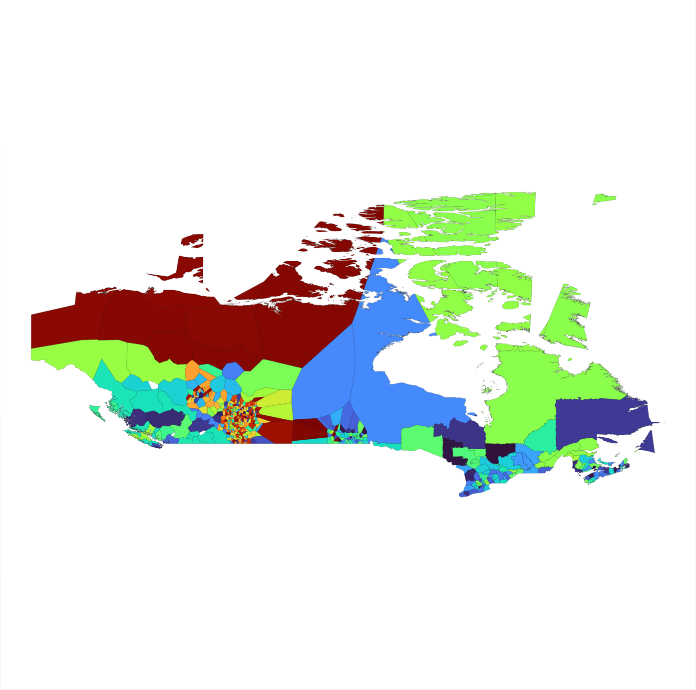

# Voronoms: an approximate set of admin area polygons for and from the GeoNames gazetteer

## What is Voronoms, and why?

Voronoms is a set of approximate polygons representing the boundaries of administrative areas in the GeoNames dataset, and a set of Python scripts to generate those areas from the coordinates of GeoNames points.

[GeoNames](https://www.geonames.org) is a free dataset of place names (a gazetteer). Each GeoNames entity represents a named location, and its metadata (described in more detail in GeoNames's [readme](http://download.geonames.org/export/dump/readme.txt)) include multiple alternate names, a single longitude and latitude point, plus its position in the administrative hierarchy of a country. For instance, [Brooklyn](https://www.geonames.org/5110302/brooklyn.html) is contained in [Kings County](https://www.geonames.org/6941775/kings-county.html), which is contained in [New York](https://www.geonames.org/5128638/new-york.html), which is in the [United States](https://www.geonames.org/6252001/united-states.html).

If you have admin-level spatial data and want to map it, GeoNames's free offering isn't useful, because it doesn't have outlines associated with anything other than countries. GeoNames does offer a [premium polygons dataset](https://www.geonames.org/products/premium-data-polygons.html), which uses officially-published polygons, and is certainly higher-quality than Voronoms. But what if you just want rough admin-level shapes globally, and can't afford that, or don't have the time to find and merge datasets from different governments yourself? **Would it be possible to approximate the shape of different regions from the data in GeoNames?** Voronoms is an attempt to do that.

## How does Voronoms make outlines from points?

Voronoms's approach roughly follows the methods laid out in [Alani et al.'s paper](https://eprints.soton.ac.uk/255705/1/Alani_IJGIS2001.pdf) "Voronoi-based region approximation for geographical information retrieval with gazetteers".

Voronoms draws a [Voronoi diagram](https://en.wikipedia.org/wiki/Voronoi_diagram) from the points of GeoNames data in a country. It groups the cells of the Voronoi diagram by the admin region they're contained in, joins adjacent cells into single polygons, and cleans the data with a few heuristics. It also uses GeoNames's country outlines data to cut out the borders of countries.

## How well does Voronoms work, and what does it look like?

GeoNames's data for some countries is less thorough or well structured than others, so this technique works really well in some cases, and less well in others. In general, higher administrative levels work better than lower ones.

For instance, Bangladesh's admin levels 1–3 look pretty well-structured.

BD-1 | BD-2 | BD-3
:---:|:---:|:---:
 |  | 

GeoNames's data for Albania is less coherent as you descend down the administrative hierarchy.

AL-1 | AL-2 | AL-3
:---:|:---:|:---:
 |  | 

Sometimes output seems to vary in quality within a single administrative level of a country.

DE-2 | CA-2 | GB-3
:---:|:---:|:---:
 |  | 

## How can I use Voronoms?

The files produced by the current version of the Voronoms algorithm are available as a [GitHub Release](https://github.com/toph-allen/voronoms/releases).

There, you'll find three zip files containing Voronoms exports in three formats, the first two of which mirror the formats of GeoNames's country outlines:
- Separate GeoJSON files, named for the country and administrative level they represent, e.g. `"GB-2.json"`. Each GeoJSON object has a `geoNameId` property linking it to a GeoNames object.
- Separate tab-separated tables, named by country and admin level, e.g. `"GB-2.txt"`. Tables have two columns, `geoNameId` and `geoJSON`.
- PNG plots of the boundaries for each country and admin level.

The zip filenames include the version of Voronoms that created them and the download date of the GeoNames file from which they were generated: `"voronoms-{voronoms-version}-{geonames-date}-{format}.zip"`.

## Generating Voronoms

The script `"generate_voronoms.py"` script generates Voronoms polygons for a requested set of countries and admin levels and writes them to disk. It is able to produce GeoJSON files and tab-separated text files, mirroring the two ways that GeoNames's country outlines are available. It can also output PNG plots of the shapes it has created.

The script accepts the following arguments:

- `--countries`, `-c`: A list of two-letter country codes for countries to plot. If none is provided, the script will iterate over all countries in the GeoNames dataset.
- `--admin-levels`, `-a`: A list of numbers specifying the admin levels to generate. If none are given, the script will attempt to generate polygons for a country's admin levels 1–3.
- `--logfile`, `-l`: The name of a file used to track which admin level/country combinations have been produced. Each line of text corresponds to one admin level and country, and is the same as the name used for the files for that combination, e.g. "US-1". The script looks for this file before it starts processing, and will skip any combinations whose label is present in this file. This can be used to resume a long-running task that's been interrupted.
- `--clean`: The polygon-cleaning heuristic used by Voronoms, "cutoff" by default. Available options are "none", "cutoff", and "simple". These are described in more detail below.
- `--formats`, `-f`: The formats to save polygons in. Any combination of "json", "txt", and "png"; all three by default.
- `--dir`, `-d`: Where to save generated files. By default, a folder named "export" is created in the directory from which the script is run.
- `--combine-format-folders`: If this option is present, the GeoJSON, tab-delimited text, and PNG files will be saved in the top level of the export directory. Otherwise, they'll be saved in separate subfolders named "json", "txt", and "png".

